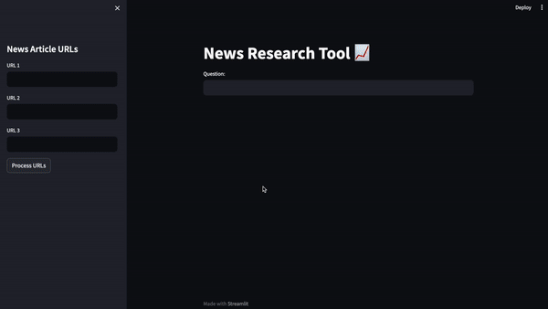

# News research tool with LangChain

## Overview

Welcome to a user-friendly news research tool, a powerful and effortless information retrieval solution. This tool allows users to input article URLs and pose questions to obtain insightful information from the stock market and financial domain. It leverages the capabilities of the `OpenAI LLM`  through the `LangChain` library. Additionally, for efficient vector database simulation, utilized the `Faiss` library. The application is built using `Streamlit`, ensuring a seamless and intuitive user experience.


## Demo



## Environment Variables

To run this project, you will need to add `OPENAI_API_KEY` environment variable to your .env file


## Run Locally

## Prerequisites

Before using this tool, make sure you have the following prerequisites installed:

- Python 3.11
- [Poetry](https://python-poetry.org/): You can install it following the [Poetry installation guide](https://python-poetry.org/docs/#installation).
- All dependencies can be installed using poetry. Simply run `poetry install` command.

Clone the project

```bash
  git https://github.com/armanbabayan/News-research-tool-with-LangChain.git
```

Go to the project directory

```bash
  cd News-research-tool-with-LangChain
```

Install dependencies

```bash
  poetry install
```

Start the server

```bash
 poetry run streamlit run  main.py
```


## Tech Stack
**Language:**  Python 3

**Library:** LangChain, Faiss, Streamlit

**Model:** OpenAI LLM

[](https://www.python.org/)  

<div style="flex: 50%; padding: 5px;">
  <a href="https://openai.com/">
    
  </a>
  <a href="https://www.langchain.com/">
    
  </a>
  <a href="https://streamlit.io/">
    
  </a>
</div>

## Roadmap

Development roadmap includes exciting features and enhancements to make this tool even more powerful.

- **Automatic News Scraping**: Implement automatic web scraping from a predefined list of websites at scheduled intervals using a `cron job`. This feature will ensure that the tool stays up-to-date with the latest news and information.

- **Advanced Vector Database**: Exploring the integration of a robust vector database system like `Pinecon` `Chroma` or `Milvus`. This upgrade will enable the efficient handling of large volumes of data, enhancing the tool's performance and scalability.

## Authors

- [@armanbabayan](https://github.com/armanbabayan)

